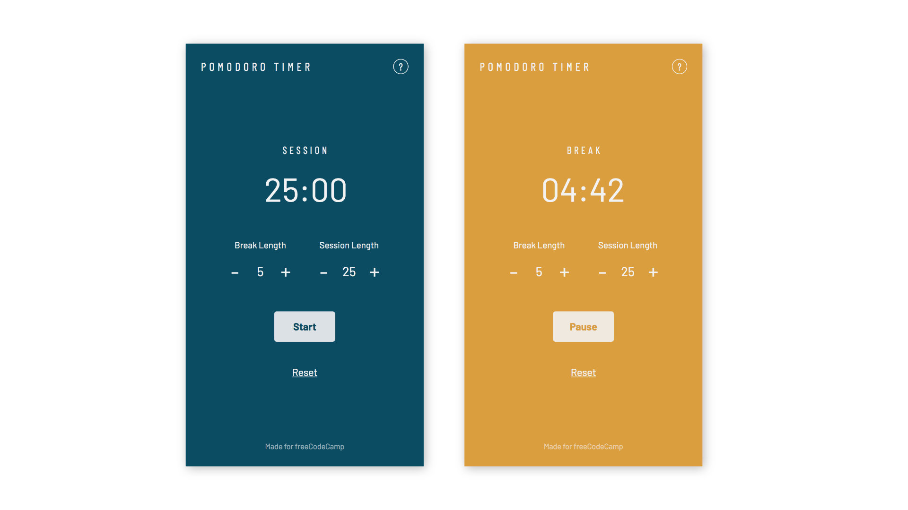
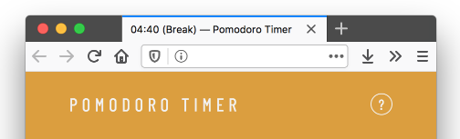
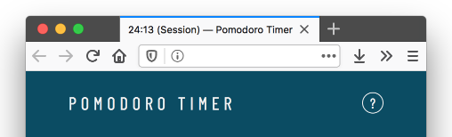
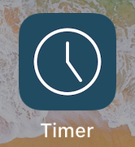

# Pomodoro-timer

> The **Pomodoro Technique** is a time management method developed by Francesco Cirillo in the late 1980s. The technique uses a timer to break down work into intervals, traditionally 25 minutes in length, separated by short breaks. Each interval is known as a pomodoro, from the Italian word for 'tomato', after the tomato-shaped kitchen timer that Cirillo used as a university student.
> 
> [Wikipedia](https://en.wikipedia.org/wiki/Pomodoro_Technique)
> 

[Visit website](https://pomodoro-timer-chi.now.sh/ "Pomodoro Timer")

This project was made for the Front-End Libraries Certification on [freeCodeCamp](https://www.freecodecamp.org/learn). See the project requirements [here](https://www.freecodecamp.org/learn/front-end-libraries/front-end-libraries-projects/build-a-pomodoro-clock).

 ## Features

- Timer in the browser\
  
  

- Editable break and sesion length (the timer will continue its cycle when the length is modified)
  
- Color changes between sessions and breaks
  
- Can be added on Home Screen\
  
  
---

### Some notes:

It was not necessary to put `<LengthControls />` as a separate component but I did it to learn how to pass props and states from child to parent.

Sounds may not work in Safari at the moment.

---

The sounds are taken from [PartnersInRhyme](https://www.partnersinrhyme.com/soundfx/PUBLIC-DOMAIN-SOUNDS/beep.shtml) — Public Domain Beeps and Clicks sounds

This project was built with [Create React App](https://github.com/facebook/create-react-app).
